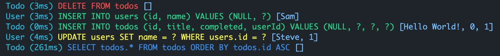

[_Sqfly_](https://github.com/hsul4n/dart-sqfly) is a simple ORM inspired from [ActiveRecord](https://github.com/rails/rails/tree/master/activerecord), built ontop of [Sqflite](https://pub.dev/packages/sqflite) and uses [DAO](https://en.wikipedia.org/wiki/Data_access_object) architecture.

1. [How does it work](#how-does-it-work)
1. [Getting Started](#getting-started)
1. [Data Access Objects](#data-access-objects)
   1. [Queries](#queries)
   1. [Finders](#finders)
   1. [Persistence](#persistence)
   1. [Calculations](#calculations)
   1. [Helpers](#helpers)
   1. [Relations](#relations)
      1. [Belongs To](#belongs-to)
      1. [Has One](#has-one)
      1. [Has Many](#has-many)
   1. [Custom Queries](#custom-queries)
1. [In-Memory](#in-memory)
1. [Migration](#migration)
1. [Import](#import)
1. [Logger](#logger)
1. [Examples](#example)

# How does it work:

_Sqlfy_ is an ORM inspired form [ActiveRecord](https://github.com/rails/rails/tree/master/activerecord) and depends on [_CREATE TABLE_](https://sqlite.org/lang_createtable.html) command which uses _Regular Expression_ ([RegExp](https://en.wikipedia.org/wiki/Regular_expression)) to analysis table defentions:

- Table name.
- Columns definition.
- Primary key.
- Foreign keys.

Note: _Sqfly_ is a runtime library so it dosen't depend on generate code using [source_gen](https://pub.dev/packages/source_gen).

# Getting Started

1. Add to your dependencies:

```yaml
dependencies:
  sqfly: ^x.x.x
```

2. Create a **Model**

```dart
// models/person.dart
class Person {
  final int id;
  final String name;
  final int age;

  const Person({this.id, this.name});

  Person.fromMap(Map<String, dynamic> map)
      : id = map['id'],
        name = map['name'],
        age = map['age'];

  Map<String, dynamic> toMap() => {
        'id': id,
        'name': name,
        'age': age,
      };
}
```

3. Create a Data Access Object **(DAO)**

```dart
// daos/person_dao.dart
class PersonDao extends Dao<Person> {
  PersonDao()
      : super(
          '''
          CREATE TABLE persons (
            id   INTEGER NOT NULL PRIMARY KEY AUTOINCREMENT,
            name TEXT    NOT NULL,
            age  INTEGER NOT NULL
          )
          ''',
          // use to decode and encode person
          converter: Converter(
            encode: (person) => Person.fromMap(person),
            decode: (person) => person.toMap(),
          ),
        );
}
```

4. Initilize your **database**

```dart
final sqfly = await Sqfly.initialize(
  /// database name
  name: 'example',
  // database version
  version: 1,
  /// pass all your daos
  daos: [
    PersonDao(),
  ],
);

// That's it (:
```

5. Usage

```dart

Sqfly.instance<UserDao>().foo().bar();
```

# Data Access Objects

## [Queries](https://api.rubyonrails.org/v6.0.3.2/classes/ActiveRecord/QueryMethods.html)

```dart
/// SELECT * FROM persons
Sqfly.instance<PersonDao>().all; // | toList()

/// SELECT id FROM persons
Sqfly.instance<PersonDao>().select(['id']).toList(); // [Person, ...]

/// SELECT * FROM persons WHERE name = 'Sam' OR name = 'Mike'
Sqfly.instance<PersonDao>().where({'name': 'Sam'}).or({'name': 'Mike'}).toList();

/// To use any other operation just pass it after attribute
// SELECT * FROM persons where age >= 5
Sqfly.instance<PersonDao>().where({'age >= ?': 5}).toList();

// SELECT * FROM persons ORDER BY name DESC
Sqfly.instance<PersonDao>().order('name DESC').toList();

// SELECT * FROM persons GROUP BY name HAVING LENGTH(name) > 3
Sqfly.instance<PersonDao>().group(['name']).having('LENGTH(name) > 3').toList();

// SELECT * FROM persons LIMIT 50 OFFSET 100
Sqfly.instance<PersonDao>().limit(1).offset(10).toList();

// SELECT DISTINCT * FROM persons
Sqfly.instance<PersonDao>().distinct().toList();
```

Includes

```dart
// SELECT * FROM persons
// SELECT * FROM dogs WHERE id IN (1)
Sqfly.instance<PersonDao>().includes([DogDao]).toList();
// [Person(id: 1, name: 'Sam', dogs: [Dog(id: 1, title: 'Roze')])]
```

Joins

```dart
// SELECT
//   dogs.*,
//   persons.id AS person_id,
//   persons.name AS person_name,
// FROM dogs
//   INNER JOIN persons ON persons.id = dogs.person_id
Sqfly.instance<DogDao>().joins([PersonDao]).toList();
// [Dog(id: 1, title: 'Roze', person: Person(id: 1, name: 'Sam'))]
```

## [Finders](https://api.rubyonrails.org/v6.0.3.2/classes/ActiveRecord/FinderMethods.html)

```dart
// SELECT * FROM persons WHERE name = 'Mike' LIMIT 1
Sqfly.instance<PersonDao>().isExists({'name': 'Mike'}); // true

// SELECT * FROM persons WHERE id = 1 LIMIT 1
Sqfly.instance<PersonDao>().find(1); // Person

// SELECT * FROM persons WHERE name = 'Mike' LIMIT 1
Sqfly.instance<PersonDao>().findBy({'name': 'Mike'}); // Person

// SELECT * FROM persons WHERE id = 1 LIMIT 1
Sqfly.instance<PersonDao>().find(1); // Person

// SELECT * FROM persons
Sqfly.instance<PersonDao>().first; // first item from select

// SELECT * FROM persons
Sqfly.instance<PersonDao>().last; // last item from select

// SELECT * FROM persons LIMIT 1
Sqfly.instance<PersonDao>().take();
//  SELECT * FROM persons LIMIT 3
Sqfly.instance<PersonDao>().take(3);
```

## [Persistence](https://api.rubyonrails.org/v6.0.3.2/classes/ActiveRecord/Persistence/ClassMethods.html)

```dart
final person = Person(id: 1, name: 'Sam', age: 33);

// INSERT INTO persons (id, name) VALUES (1, 'Sam')
Sqfly.instance<PersonDao>().create(person); // | createAll
// Also you can use `insert` which accepts map
Sqfly.instance<PersonDao>().insert(person.toMap()); // insertAll

// UPDATE persons SET name = 'Steve', age = 33 WHERE id = 1
Sqfly.instance<PersonDao>().update(person..name = 'Steve'); // | updateAll

// DELETE FROM persons WHERE id = 1
Sqfly.instance<PersonDao>().delete(person);

// DELETE FROM persons WHERE id = 1
Sqfly.instance<PersonDao>().destroy(1); // destroyAll (truncate)
```

One to one

```dart
// INSERT INTO persons (id, name, age) VALUES (NULL, 'Sam', 16);
// INSERT INTO dogs (id, title, person_id) VALUES (NULL, 'Roze', 1);
Sqfly.instance<DogDao>().create(
  Dog(
      title: 'Roze',
      person: Person(name: 'Sam', age: 16),
    ),
)
```

One to many

```dart
// INSERT INTO persons (id, name, age) VALUES (NULL, 'Mike', 21);
// INSERT INTO dogs (id, title, person_id) VALUES (NULL, 'Roze', 1);
Sqfly.instance<PersonDao>().create(
  Person(
      name: 'Mike',
      age: 21,
      dogs: [
        Dog(title: 'Roze'),
        // ...
      ],
    ),
)
```

## [Calculations](https://api.rubyonrails.org/v6.0.3.2/classes/ActiveRecord/Calculations.html)

```dart
/// SELECT COUNT(*) FROM persons
Sqfly.instance<PersonDao>().count(); // 3

/// SELECT COUNT(name) FROM persons
Sqfly.instance<PersonDao>().count('name'); // 3

/// SELECT AVG(age) FROM persons
Sqfly.instance<PersonDao>().average('age'); // 7.4

/// SELECT id FROM persons
Sqfly.instance<PersonDao>().ids; // [1, 2, 3, ..]

/// SELECT MAX(age) FROM persons
Sqfly.instance<PersonDao>().maximum('age'); // 10

/// SELECT MIN(age) FROM persons
Sqfly.instance<PersonDao>().minimum('age'); // 1

/// SELECT name, age FROM persons LIMIT 1
Sqfly.instance<PersonDao>().pick(['name', 'age']); // ['Mike', 10]

/// SELECT name FROM persons
Sqfly.instance<PersonDao>().pluck(['name', 'age']); // [['Mike', 'Sam'], ...]

/// SELECT SUM(age) FROM persons
Sqfly.instance<PersonDao>().sum('age'); // 10.1
```

## Helpers

```dart
/// convert query to list
Sqfly.instance<PersonDao>().foo().bar().toList(); // [Person, ...]
/// convert query to map
Sqfly.instance<PersonDao>().foo().bar().toMap(); // [{id: 1, name: 'Mike', age: 10}, ...]

/// alias [count] > 0
Sqfly.instance<PersonDao>().foo().bar().isEmpty; // | isNotEmpty
```

## Relations

Make sure to add `FOREIGN KEY` between tables.

### Belongs To

```diff
// daos/todo_dao.dart
class DogDao extends Dao<Dog> {
  DogDao()
      : super(
+          relations: [
+            /// Make sure to add forign_key in sql defention
+            BelongsTo<PersonDao>(),
+          ],
        );
}
```

### Has One

```diff
// daos/todo_dao.dart
class DogDao extends Dao<Dog> {
  DogDao()
      : super(
+          relations: [
+            HasOne<PersonDao>(),
+          ],
        );
}
```

### Has Many

```diff
// daos/person_dao.dart
class PersonDao extends Dao<Person> {
 PersonDao()
      : super(
+          relations: [
+            HasMany<DogDao>(),
+          ],
        );
}
```

## Custom Queries

_Sqlfy_ is scalable with custom and complex queries so for example let's say we want to filter adult people we can add:

```diff
class PersonDao extends Dao<Person> {
  ...
+  Future<List<Person>> get adults {
+    return where({'age >= ?': 18}).toList();
+  }
  ...
}
```

You can also use more complex queries by accessing `database` object

```diff
class PersonDao extends Dao<Person> {
  ...
+  Future<List<Person>> get custom async {
+     // Use your custom query
+     final results = await database.rawQuery('SELECT * FROM people');
+
+     // when returning result use converter
+     return results.map((result) => converter.encode(result) as Person).toList();
+  }
  ...
}
```

# In-Memory

To use in-memory database set `memory` property to `true`

```diff
final sqfly = Sqfly(
+  memory: true',
)
```

# Import

To import exists database:

1. Copy exists database to `assets/database.db`
2. Add path to assets in `pubspec.yaml`

```diff
+ flutter:
+   assets:
+     - assets/database.db
```

3. Set `import` property to `true`

```diff
final sqfly = Sqfly(
+  import: true,
)
```

4. Run

# Migration

Because of depends on _CREATE TABLE_ command as explaned [above](#how-does-it-work) so that prevent using migrations because all new migrations will not be avalible in `SQL` command that located inside `Dao` class, so one of the best soultions was to use force migration by creating new table and move all data:

1. Modify your sql command by adding or removing some defention for example:

```diff
class PersonDao extends Dao<Person> {
  PersonDao()
      : super(
          '''
          CREATE TABLE persons (
            id   INTEGER NOT NULL PRIMARY KEY AUTOINCREMENT,
            name  TEXT    NOT NULL,
            age   INTEGER NOT NULL,
+           phone INTEGER NOT NULL
          )
          ''',
        );
}
```

1. Change database version.

```diff
final sqfly = Sqfly(
-  version: 1,
+  version: 2, // or any version your want
).init();
```

1. Have fun

_Note: **Don't** add `NOT NULL` columns while migrating unless you pass `DEFAULT` value._

To know more visit [github](https://github.com/hsul4n/dart-sqfly/tree/master/lib/src/migration.dart).

# Logger

_Sqfly_ delivers the same [ActiveRecord](https://github.com/rails/rails/tree/master/activerecord) logger as shown below

VSCode


Note: By default `logger` is _enabled_ while you're in debug mode, if you want to disable it just set `logger` property to `false`.

```diff
final sqfly = Sqfly(
+  logger: false,
)
```

# Examples

- [Todos Example](https://github.com/hsul4n/dart-sqfly/tree/master/example)

# Features & Bugs

Feature requests and bugs at the [issue tracker](https://github.com/hsul4n/dart-sqfly).
